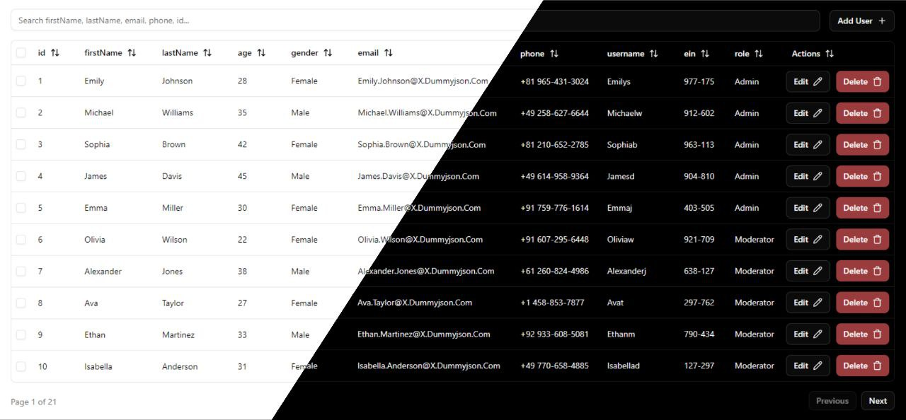

# Jinx Table

[](https://www.npmjs.com/package/jinx-table) [](https://www.npmjs.com/package/jinx-table)

A modern, customizable React table component library built with Vite, Tailwind CSS, and Radix UI. Jinx Table provides flexible table rendering, sorting, filtering, pagination, and selection, along with a set of reusable UI components.



Get it on npm: [jinx-table](https://www.npmjs.com/package/jinx-table)

## Features

- **Flexible Key System**: Support both simple string keys and object keys with custom headers and cell rendering.
- **Dynamic Table Rendering**: Easily display data with customizable columns and cell rendering.
- **Sorting, Filtering, Pagination**: Built-in support for common table operations.
- **Row Selection**: Optional checkbox selection for rows with `checkboxColumn()` utility.
- **Composable UI Components**: Includes Button, Input, Checkbox, Dialog, and Table primitives.
- **Utility Functions**:
  - `cn()` - Smart class name merging with Tailwind CSS conflict resolution
  - `createColumn()` - Easy column creation with sorting and custom cell rendering
  - `checkboxColumn()` - Pre-built checkbox selection column
- **TypeScript-friendly (JSX/JS)**: Written in modern React with hooks and functional components.
- **Zero Configuration**: Works out of the box with sensible defaults.

## Project Structure

```
src/
  components/
    react-table/
      JinxTable.jsx         # Main table component with advanced features
    ui/
      button.jsx            # Button component (variants, sizes)
      checkbox.jsx          # Checkbox (Radix UI)
      dialog.jsx            # Dialog/modal (Radix UI)
      input.jsx             # Styled input field
      table.jsx             # Table primitives (Table, TableRow, etc.)
  lib/
    utils.js                # Utility for merging class names
  utils/
    columnsUtils.jsx        # Helpers for column/checkbox column creation
```

## Usage

### Installation

#### As an npm package:

```sh
npm install jinx-table
# or
yarn add jinx-table
```

#### From source:

1. **Clone the repository:**
   ```sh
   git clone <your-repo-url>
   cd jinx-table
   ```
2. **Install dependencies:**
   ```sh
   npm install
   # or
   yarn install
   ```
3. **Start the development server:**
   ```sh
   npm run dev
   # or
   yarn dev
   ```

### Basic Example

#### When using as npm package:

```jsx
import { JinxTable } from "jinx-table";

const data = [
  { id: 1, name: "Alice", age: 25, status: "active" },
  { id: 2, name: "Bob", age: 30, status: "inactive" },
];

export default function App() {
  return (
    <JinxTable
      data={data}
      keys={["name", "age", "status"]}
      filterFields={["name"]}
      isCheckbox={true}
      isPagination={true}
      total={data.length}
      limit={10}
      skip={0}
      loading={false}
    />
  );
}
```

````

#### When using from source:

```jsx
import JinxTable from "./src/components/react-table/JinxTable";

const data = [
  { id: 1, name: "Alice", age: 25, status: "active" },
  { id: 2, name: "Bob", age: 30, status: "inactive" },
];

export default function App() {
  return (
    <JinxTable
      data={data}
      keys={["name", "age", "status"]}
      filterFields={["name"]}
      isCheckbox={true}
      isPagination={true}
      total={data.length}
      limit={10}
      skip={0}
      loading={false}
    />
  );
}
````

### Complete Example with Mixed Key Types

```jsx
import { JinxTable } from "jinx-table";

const data = [
  {
    id: 1,
    name: "Alice",
    email: "alice@example.com",
    age: 25,
    status: "active",
  },
  { id: 2, name: "Bob", email: "bob@example.com", age: 30, status: "inactive" },
];

export default function App() {
  const keys = [
    "name", // Simple string key
    {
      header: "Email Address",
      cell: (data) => (
        <a
          href={`mailto:${data.email}`}
          className="text-blue-600 hover:underline"
        >
          {data.email}
        </a>
      ),
    },
    {
      header: "Age",
      cell: (data) => (
        <span className="font-semibold">{data.age} years old</span>
      ),
    },
    {
      header: "Status",
      cell: (data) => (
        <span
          className={`px-2 py-1 rounded-full text-xs font-medium ${
            data.status === "active"
              ? "bg-green-100 text-green-800"
              : "bg-red-100 text-red-800"
          }`}
        >
          {data.status}
        </span>
      ),
    },
  ];

  return (
    <JinxTable
      data={data}
      keys={keys}
      filterFields={["name", "email"]}
      isCheckbox={true}
      isPagination={false}
      loading={false}
    />
  );
}
```

### Flexible Key System

JinxTable supports two ways to define table columns:

#### 1. Simple String Keys

```jsx
// Pass an array of field names
const keys = ["name", "email", "age", "status"];

<JinxTable
  data={data}
  keys={keys}
  // ... other props
/>;
```

#### 2. Object Keys with Custom Configuration

```jsx
// Pass objects with header and optional cell rendering
const keys = [
  "name", // Simple string key
  {
    header: "Email Address",
    cell: (data) => <a href={`mailto:${data.email}`}>{data.email}</a>,
  },
  {
    header: "Age",
    cell: (data) => <span className="font-bold">{data.age} years</span>,
  },
  {
    header: "Status",
    cell: (data) => (
      <span
        className={`px-2 py-1 rounded text-xs ${
          data.status === "active"
            ? "bg-green-100 text-green-800"
            : "bg-red-100 text-red-800"
        }`}
      >
        {data.status}
      </span>
    ),
  },
];

<JinxTable
  data={data}
  keys={keys}
  // ... other props
/>;
```

### Custom Columns with Utilities

```jsx
import { createColumn, checkboxColumn } from "jinx-table";

// Define your columns
const columns = [
  checkboxColumn(), // Add row selection
  createColumn({
    accessorKey: "name",
    header: "Name",
    cell: (data) => <span className="font-semibold">{data.name}</span>,
  }),
  createColumn({
    accessorKey: "email",
    header: "Email",
  }),
  createColumn({
    accessorKey: "status",
    header: "Status",
    cell: (data) => (
      <span
        className={`px-2 py-1 rounded text-xs ${
          data.status === "active"
            ? "bg-green-100 text-green-800"
            : "bg-gray-100 text-gray-800"
        }`}
      >
        {data.status}
      </span>
    ),
  }),
];
```

### UI Components

- **Button**: Variant, size, and icon support
- **Input**: Styled input for search/filter
- **Checkbox**: Accessible, Radix-based
- **Dialog**: Modal dialog for forms or details
- **Table**: Table primitives for custom layouts

## Customization

- **Styling**: Uses Tailwind CSS for easy customization
- **Slots & Props**: All components accept `className` and other props for flexibility
- **Extendable**: Add your own columns, dialogs, or actions as needed

## Utilities

### Core Utilities

- `cn(...inputs)`: Merges class names and resolves Tailwind conflicts
- `createColumn({ accessorKey, header, cell })`: Helper for defining table columns with sorting and custom cell rendering
- `checkboxColumn()`: Adds a selection checkbox column for row selection

### Usage Examples

```jsx
import { cn, createColumn, checkboxColumn } from "jinx-table";

// Using cn utility for class merging
const buttonClass = cn("px-4 py-2", "bg-blue-500", "hover:bg-blue-600");

// Creating a custom column
const nameColumn = createColumn({
  accessorKey: "name",
  header: "Full Name",
  cell: (data) => <span className="font-bold">{data.name}</span>,
});

// Adding checkbox selection
const columns = [
  checkboxColumn(),
  nameColumn,
  // ... other columns
];
```

### Advanced Column Configuration

```jsx
// Column with custom header and cell rendering
const statusColumn = createColumn({
  accessorKey: "status",
  header: "Status",
  cell: (data) => (
    <span
      className={`px-2 py-1 rounded ${
        data.status === "active"
          ? "bg-green-100 text-green-800"
          : "bg-red-100 text-red-800"
      }`}
    >
      {data.status}
    </span>
  ),
});

// Column with sorting enabled (default)
const ageColumn = createColumn({
  accessorKey: "age",
  header: "Age",
});
```

## Dependencies

- React
- Vite
- Tailwind CSS
- Radix UI (Dialog, Checkbox)
- @tanstack/react-table
- lucide-react (icons)
- class-variance-authority, clsx, tailwind-merge

## Publishing

To publish this package to npm:

1. **Build the package:**

   ```sh
   npm run build
   ```

2. **Login to npm:**

   ```sh
   npm login
   ```

3. **Publish:**
   ```sh
   npm publish
   ```

The `prepublishOnly` script will automatically build the package before publishing.

## License

MIT
